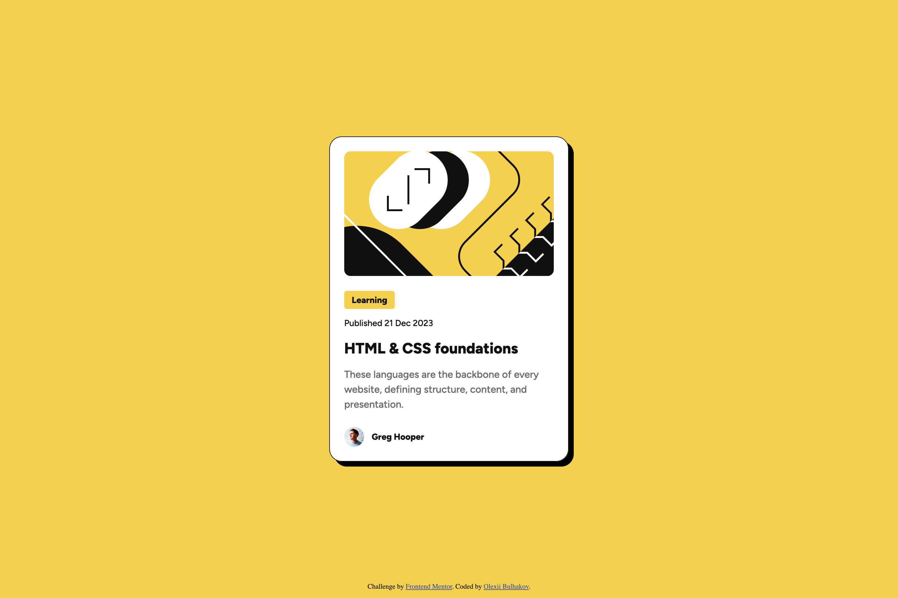

# Frontend Mentor - Blog preview card solution

This is a solution to the [Blog preview card challenge on Frontend Mentor](https://www.frontendmentor.io/challenges/blog-preview-card-ckPaj01IcS). Frontend Mentor challenges help you improve your coding skills by building realistic projects.

## Table of contents

- [Overview](#overview)
  - [The challenge](#the-challenge)
  - [Screenshot](#screenshot)
  - [Links](#links)
- [My process](#my-process)
  - [Built with](#built-with)
  - [What I learned](#what-i-learned)
  - [Useful resources](#useful-resources)
- [Author](#author)

## Overview

### The challenge

Users should be able to:

- See hover and focus states for all interactive elements on the page

### Screenshot



### Links

- Solution URL: [GitHub repo](https://github.com/bulhakovolexii/blog-preview-card/)
- Live Site URL: [GinHub Pages](https://bulhakovolexii.github.io/blog-preview-card/)

## My process

### Built with

- Semantic HTML5 markup
- [SASS](https://sass-lang.com/)
- Flexbox
- [Normalize.css](https://necolas.github.io/normalize.css/)
- [Google fonts](https://fonts.google.com/)

### What I learned

In this project, I decided to use SASS to predefine the necessary mixins for typography.

Additionally, I really liked the extra requirement to make the fonts responsive without using media queries.

I achieved an excellent result using the following approach:

```scss
// typography
@mixin text-preset-1 {
  font-family: "Figtree Extra Bold", sans-serif;
  font-size: clamp(20px, 5vw, 24px);
  line-height: 150%;
  letter-spacing: 0px;
}
```

To determine the second argument in clamp, I had to check the actual font size at a viewport width of 375px.

### Useful resources

- [Sass installation](https://sass-lang.com/install/) - Here you can find instructions on installing the preprocessor and setting up a project for development.

## Author

- GitHub - [@bulhakovolexii](https://github.com/bulhakovolexii)
- Frontend Mentor - [@bulhakovolexii](https://www.frontendmentor.io/profile/bulhakovolexii)
- LinkedIn - [@bulhakovolexii](https://www.linkedin.com/in/bulhakovolexii/)
